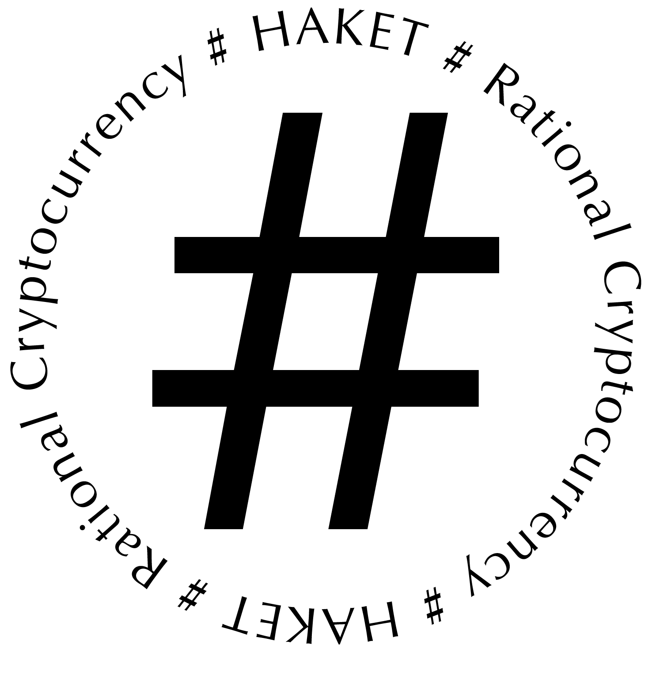

# Haket

Haket Information Center

[Whitepaper in progress with BTC:HAKET patch](https://pad.riseup.net/p/r.2194016c0fe88594ba97212fe091ec10)

**NEW** Commentary on our presentation at Moneylab 8 at [We Make Money not Art](https://we-make-money-not-art.com/value-extraction-and-the-workforce-of-the-cryptocene/)  \

[FB](https://web.facebook.com/pg/HaketRC/about/)  \
[Presentation at Kunsthalle Mulhouse](http://kunsthallemulhouse.com/oeuvres/haket-rational-cryptocurrency/algotaylorism14/)  \
[Presentation à Cryptopolitiques - en français](https://www.youtube.com/watch?v=Q6VI6_KtIqc)  
